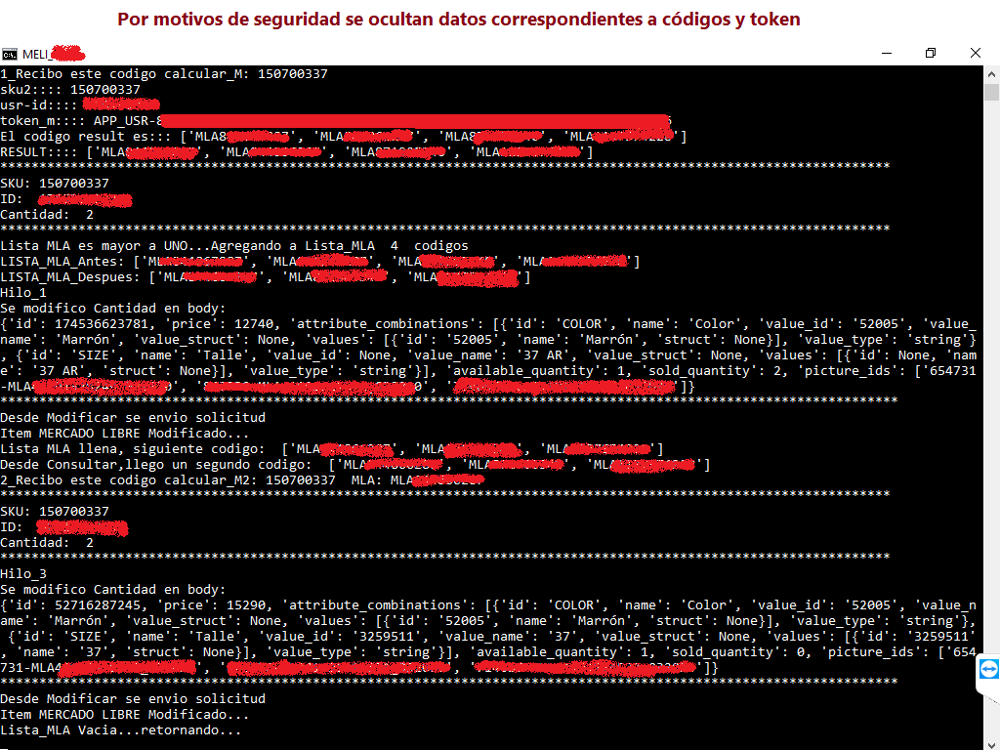

<h1 align="center">Sincronización Api Mercadolibre - Base de Datos Mysql</h1>

  

Este repositorio contiene scripts en Python que utilizan la API de Mercado Libre para filtrar y obtener información de los productos que se encuentran en una cuenta de usuario. El script inicia sesión en la API de Mercado Libre, obtiene un token de acceso y utiliza ese token para realizar solicitudes a la API de Mercado Libre.

El script tiene varias funciones que se encargan de filtrar los productos de la cuenta de usuario, obtener información detallada de los productos y almacenar la información en una base de datos MySQL.

El código contiene un archivo llamado "lanzador_EmpresaX.bat" que desencadena la sincronización, alguna de las funciones del archivo inicial (consultar_EmpresaX.py) es "filtrar_MLA", que filtra todos los productos de la cuenta de usuario y obtiene información básica de cada uno de ellos. Luego utiliza la función "filtrar_SKU" para obtener información detallada de cada variación de los productos, como la cantidad disponible y el SKU del vendedor.

El script utiliza un archivo de texto llamado "meli.txt" para almacenar información como el token de acceso, el ID de cliente, el secreto de cliente, el URI de redireccionamiento, el código de autorización y el token de actualización. Toda esta sincronización la realiza intercambiando información con una base de datos Mysql, especificamente de una tabla llamada "sincro" para mantener sincronizado principalmente el Stock de un sistema de gestión y el stock de Mercado Libre correspondiente a la cuenta del usuario.
  
 Para implementar es necesaria la instalación de algunas bibliotecas de Python, como "requests" y "pymysql" y la de "mercadolibre" disponibles en https://pypi.org/

